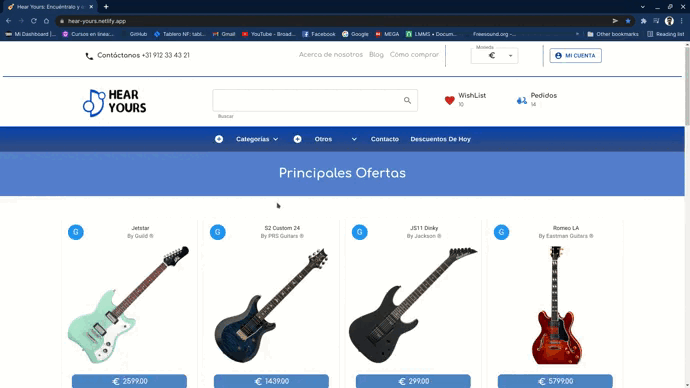

# Hear Yours - Ecommerce 

<div style="display: flex; justify-content: center; padding: 10px; background-color: #261F1E; border-radius: 10px">
  
</div>

This is a beautiful web app developed by me, Cristian, which includes a navbar, product detail view, a cart and an orders view.

## Authors

- [@cristiansanm](https://www.github.com/cristiansanm)

## Features

- Connected with Firebase
- App created with React Js
- Full frontend platform

## Demo


</br>
<https://hear-yours.netlify.app/>

## Installation

1. First download the project from my repository.
2. Then, install all the dependecies from npm*.

```bash
  npm install 
```

*Remeber that this app was build on 16.13.1 version of npm, so remember to update your version if it's not updated to this one.

3.Run the app

### `npm run start`

4.That's it, you can make a build or anything you want.

## Related dependencies

Here are the dependencies and libraries used in this app.

### React-Hook-Form

- Used  for validating the user form when you are making an order.

### React-Router-Dom

- Used for navigating between every view on the app. This dependence manages the routes and avoids reloading every click on any \<a> tag.

### Firebase

- This is a Google service, which provides an database and sophisticated queries for CRUD manipulation.

### Sass

- Used for pre-processing all the CSS. Helps to reduce repetions and therefore saves time.

### Moment Js

- A library that formats the vanilla Javascrit dates to any type. Includes dates calculations and many other features.

### Material UI

- A big frontend library made with React. It brings functional components, completed styled objects and other functionalities prepared to make a friendly development

## Roadmap

- Make a UX design


- Implement firebase


- Deploy on Netlify


- Refactore code


- Implement search bar

- Add a log in and sign up

- Add a admin version for restoring stock

- Add a newsletter when new arrivals are released

- Add a global money exchange (€ to $)

- Add a single order view

- Add a wishlist functionality
